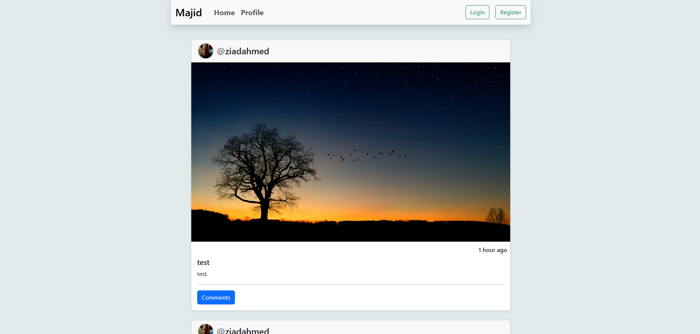

# Social Media-Inspired Website

🚀 **Exciting News**! I’ve launched a new social media-inspired website! 

## Demo

[Experience the Demo](https://github.com/ayoubmajid67/Youbista.git)

## Features

- **Comprehensive API**: The website leverages a robust API, ensuring seamless user interaction.
- **User Interaction**: Engage with posts, tags, and more, creating a dynamic user experience.
- **Authentication**: Backed by strong authentication for secure user access.
- **Rich Online Community**: Explore various pages including:
  - **Home**: The central hub for browsing posts and updates.
  - **Profile**: A dedicated space for users to manage their information and posts.
  - **Post Details**: Detailed views of individual posts, featuring pagination and interactive elements.

## Acknowledgments

A special thanks to **Yarob Al Mostafa** for providing this awesome API, which made this project possible!

**#WebDevelopment #SocialMediaApp** 

---

Feel free to modify any sections as needed to suit your style!